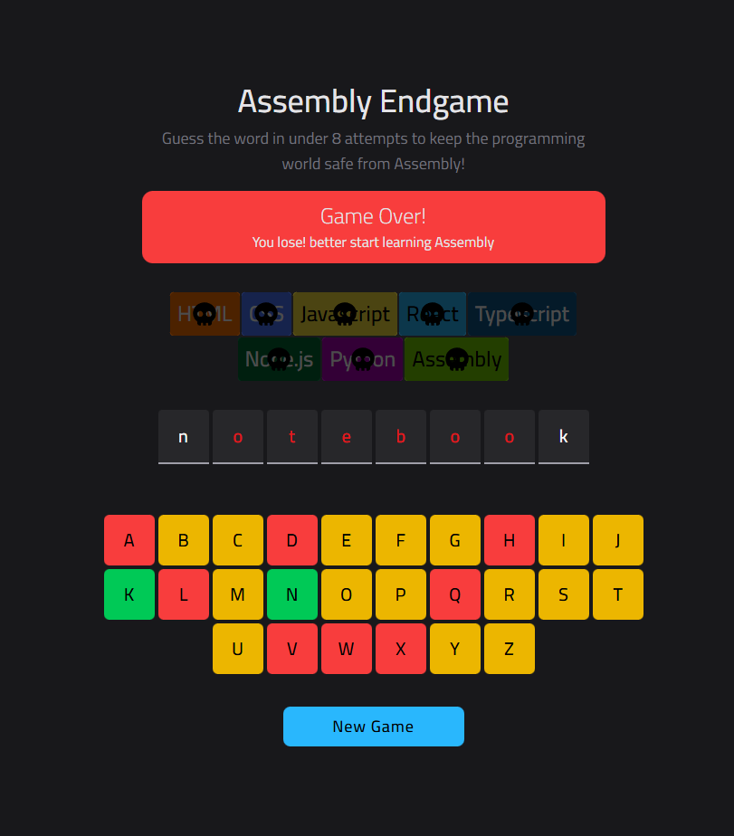
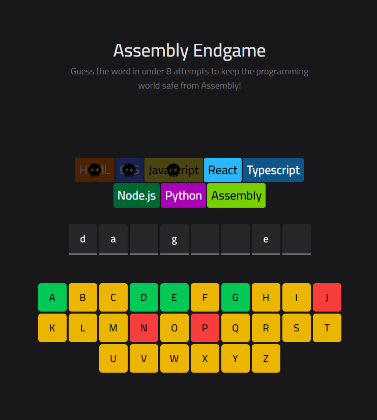

# ⚡ Assembly Endgame

**Guess the word before the tech skulls take over!** 🖤💀

A **Hangman-style game** built with **React, TypeScript, TailwindCSS & Vite**. Can you survive all 8 lives and win the game?

**🎮 Play Online:** [Assembly Endgame Live](https://ahmedbadry-dev.github.io/assembly-endgame/)

---

## 🎮 How to Play

1. Click letters on the **keyboard** below.
2. Correct letters appear in the secret word.
3. Wrong letters decrease your **lives**.
4. Each wrong guess adds a **skull overlay** on the Tech Stack.
5. Guess all letters before losing all lives to **win** and trigger **Confetti**! 🎉

---

## 🖥️ Technologies Used

- **React** – interactive UI
- **TypeScript** – type safety
- **TailwindCSS** – modern styling
- **Vite** – blazing fast bundler
- **react-confetti** – win celebration
- **SVG Assets** – skull overlays

---

## 💀 Features

- Interactive **keyboard UI**
- Dynamic **Tech Stack overlay** with skulls for wrong guesses
- Lives counter with **visual feedback**
- **Confetti + glow effect** on win
- Clean, responsive **design** for all screens
- **Restart anytime** with “New Game” button

---

## 🖼 Screenshots

## **Wining**


## **Losing**



## **Playing**


> Replace these images with your real screenshots for the repo.

---

## 🗂️ Project Structure

```
assembly-endgame/
│
├─ src/
│   ├─ assets/       # Skull image & other assets
│   ├─ components/   # GameBoard, Keyboard, Header
│   ├─ data/         # words & techStack
│   ├─ hooks/        # useGameLogic
│   ├─ App.tsx
│   └─ main.tsx
│
├─ package.json
├─ tailwind.config.js
├─ vite.config.ts
└─ README.md
```

---

## 🚀 Run Locally

```bash
git clone https://github.com/ahmedbadry-dev/assembly-endgame.git
cd assembly-endgame
npm install
npm run dev
```

Open [http://localhost:5173](http://localhost:5173) to play!

---

## 🔮 Customize

- Words, Tech Stack, colors, and assets are in `src/data/words.ts`.
- Add new challenges, letters, or effects easily.

---

## ⚡ License

MIT © 2025 Ahmed Badry
